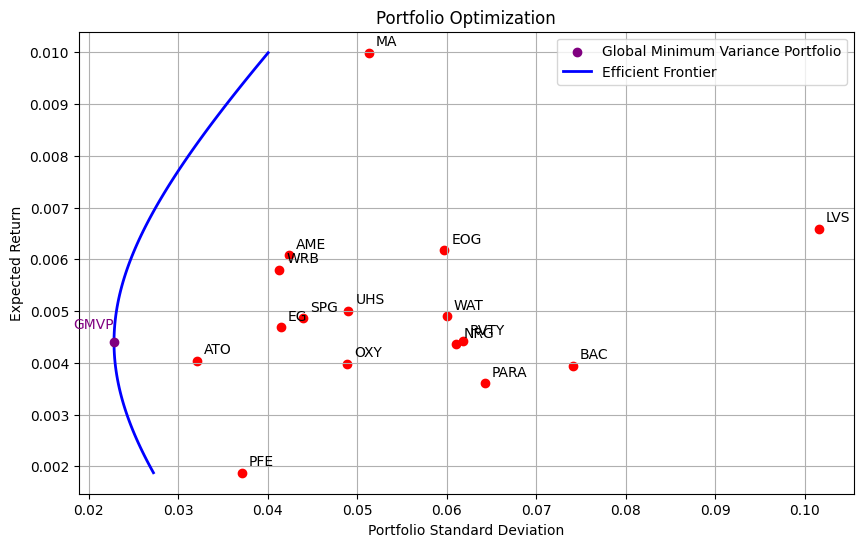
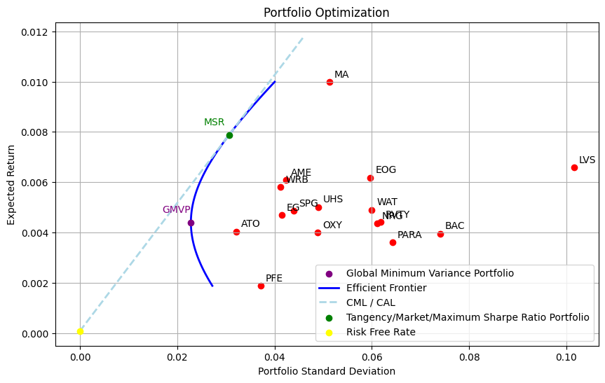

# Modern Portfolio Theory & CAPM Implementation

[](https://www.python.org/downloads/)
[](https://numpy.org/)
[](https://opensource.org/licenses/MIT)

A rigorous implementation of Modern Portfolio Theory (MPT) and the Capital Asset Pricing Model (CAPM) with advanced linear algebra techniques for portfolio optimization. Features PCA-based covariance matrix denoising and comprehensive mathematical derivations.

**📄 [View Full Paper]([https://github.com/javidsegura/portfolio-optimization](https://www.overleaf.com/project/680257ae73d1ed222a3de163))** | **📓 [Jupyter Notebook](https://github.com/javidsegura/portfolio-optimization/blob/main/portfolio.ipynb)** | **📚 [Function Library](https://github.com/javidsegura/portfolio-optimization/tree/main/library)**

---

## Overview

This project implements Nobel Prize-winning financial models (Harry Markowitz, 1990) for quantitative portfolio optimization. Built from first principles with rigorous mathematical derivations, it provides a complete framework for:

- **Efficient Frontier Construction**: Constrained optimization using Lagrangian mechanics
- **Risk-Return Analysis**: Variance minimization with expected return constraints
- **CAPM Implementation**: Tangency portfolio and Capital Market Line (CML)
- **PCA-Based Denoising**: Eigenvalue shrinkage for high-dimensional covariance matrices
- **Matrix Inversion**: Gaussian elimination for computing Σ⁻¹

### Key Features

- ✅ **20+ Function Library**: Production-ready implementations of all portfolio metrics
- ✅ **Mathematical Rigor**: Complete proofs for GMVP, efficient frontier, tangency portfolio
- ✅ **Linear Algebra Focus**: Matrix operations, eigendecomposition, constrained optimization
- ✅ **PCA Innovation**: Novel covariance denoising via eigenvalue shrinkage
- ✅ **Constant Expected Return (CER) Model**: Assumes i.i.d. normally distributed returns

---

## Mathematical Framework

### Model Assumptions

Consider a portfolio \(R_p\) with \(n\) risky assets. Under the **Constant Expected Return (CER) model**:

1. Returns are **i.i.d.** (independent and identically distributed)
2. Returns follow a **multivariate normal distribution**: \(R_p \sim \mathcal{N}(\boldsymbol{\mu}, \boldsymbol{\Sigma})\)
3. Time-invariant mean and variance

**Portfolio return**:
```
μₚ = w^T · μ    (expected return)
σₚ² = w^T · Σ · w    (variance/risk)
```

Where:
- \(w \in \mathbb{R}^n\): weight vector (\(\sum w_i = 1\))
- \(\mu \in \mathbb{R}^n\): expected return vector
- \(\Sigma \in \mathbb{R}^{n \times n}\): covariance matrix (symmetric, positive semi-definite)

---

## Core Algorithms

### 1. Global Minimum Variance Portfolio (GMVP)

**Objective**: Minimize portfolio variance without return constraint.

**Optimization Problem**:
```
minimize    w^T Σ w
subject to  w^T 1 = 1
```

**Solution** (via Lagrangian mechanics):
```
w_GMVP = (Σ⁻¹ · 1) / (1^T · Σ⁻¹ · 1)

σ²_GMVP = 1 / (1^T · Σ⁻¹ · 1)
```

**Significance**: Defines the boundary between efficient and inefficient frontiers. Any portfolio below GMVP has higher risk for lower return.

---

### 2. Efficient Frontier

**Objective**: For each target return \(R_p\), find the minimum-variance portfolio.

**Primal Problem**:
```
minimize    w^T Σ w
subject to  w^T 1 = 1
            w^T μ = R_target
```

**Dual Problem** (equivalent by convexity):
```
maximize    w^T μ
subject to  w^T 1 = 1
            w^T Σ w = σ²_target
```

**Solution**:

Define scalars:
```
A = 1^T Σ⁻¹ 1
B = 1^T Σ⁻¹ μ
C = μ^T Σ⁻¹ μ
D = AC - B²
```

**Optimal weights**:
```
w*(Rₚ) = Σ⁻¹ · [(A·Rₚ - B)·μ + (C - B·Rₚ)·1] / D
```

**Minimum variance**:
```
σₚ²(Rₚ) = (A·Rₚ² - 2B·Rₚ + C) / D
```

**Geometric interpretation**: The efficient frontier is a **convex parabola** (Markowitz Bullet) in risk-return space, starting at GMVP.

---

### 3. Capital Asset Pricing Model (CAPM)

**Objective**: Introduce a risk-free asset \(R_f\) and find the tangency portfolio that maximizes the Sharpe ratio.

**Capital Allocation Line (CAL)**:
```
E[Rₚ] = Rₓ + [(E[Rₚ] - Rₓ) / σₚ] · σc

where Sharpe Ratio = (E[Rₚ] - Rₓ) / σₚ
```

**Optimization Problem** (maximize squared Sharpe ratio):
```
maximize    (w^T α)² / (w^T Σ w)
subject to  w^T 1 = 1

where α = μ - Rₓ·1
```

**Solution** (tangency portfolio):
```
w_tangency = Σ⁻¹·α / (1^T · Σ⁻¹ · α)
           = Σ⁻¹·(μ - Rₓ·1) / (1^T · Σ⁻¹ · (μ - Rₓ·1))
```

**Investor allocation**:
- \(\alpha = 0\): 100% risk-free asset
- \(\alpha = 1\): 100% tangency portfolio
- \(\alpha > 1\): Leveraged position (borrowing at \(R_f\))

---

### 4. PCA-Based Covariance Denoising

**Problem**: As \(n\) (number of assets) increases, the sample covariance matrix \(\Sigma\) becomes noisy due to finite observations. Small eigenvalues are particularly susceptible to estimation error.

**Solution**: Eigenvalue shrinkage via PCA.

#### Algorithm

1. **Eigendecomposition**:
   ```
   Σ = Q Λ Q^T
   
   where:
   - Q = [q₁, ..., qₙ] (orthogonal eigenvector matrix)
   - Λ = diag(λ₁, ..., λₙ) (eigenvalues: λ₁ ≥ λ₂ ≥ ... ≥ λₙ ≥ 0)
   ```

2. **Eigenvalue Filtering** (choose \(k < n\)):
   ```
   λ'ᵢ = { λᵢ,                           if i ≤ k
          { (1/(n-k)) · Σⱼ₌ₖ₊₁ⁿ λⱼ,     if i > k
   ```

3. **Reconstruction**:
   ```
   Σ_filtered = Q Λ' Q^T
   ```

**Rationale**: 
- Top \(k\) eigenvalues capture signal (market factors)
- Bottom \(n-k\) eigenvalues contain noise → replace with their average
- Reduces sensitivity to individual asset fluctuations

---

### 5. Matrix Inversion via Gaussian Elimination

To compute \(\Sigma^{-1}\) for arbitrary \(n \times n\) matrices, we use **augmented matrix reduction**:

**Algorithm**:
```
[Σ | I] → [I | Σ⁻¹]
```

**Steps**:
1. Form augmented matrix \([A \mid I_n]\)
2. Apply elementary row operations (forward elimination)
3. Reduce left block to identity matrix
4. Right block becomes \(A^{-1}\)

**Complexity**: \(O(n^3)\)

**Example** (3×3 matrix):
```
[ 1  2  3 | 1  0  0 ]     [ 1  0  0 | -24  18   5 ]
[ 0  1  4 | 0  1  0 ]  →  [ 0  1  0 |  20 -15  -4 ]
[ 5  6  0 | 0  0  1 ]     [ 0  0  1 |  -5   4   1 ]

∴ A⁻¹ = [-24  18   5]
        [ 20 -15  -4]
        [ -5   4   1]
```

---

## Installation

```bash
# Clone repository
git clone https://github.com/javidsegura/portfolio-optimization.git
cd portfolio-optimization

# Install dependencies
pip install -r requirements.txt

# Launch Jupyter notebook
jupyter notebook portfolio.ipynb
```

### Dependencies
```txt
numpy>=1.21.0
pandas>=1.3.0
matplotlib>=3.4.0
scipy>=1.7.0
```

---

## Usage

### Quick Start

```python
import numpy as np
from library.portfolio_tools import (
    compute_efficient_frontier,
    compute_gmvp,
    compute_tangency_portfolio,
    apply_pca_denoising
)

# Load asset returns (shape: n_observations × n_assets)
returns = np.loadtxt('data/asset_returns.csv', delimiter=',')

# Compute statistics
mu = returns.mean(axis=0)  # Expected returns
Sigma = np.cov(returns.T)   # Covariance matrix

# Apply PCA denoising (keep top 10 components)
Sigma_filtered = apply_pca_denoising(Sigma, k=10)

# Compute GMVP
w_gmvp, sigma_gmvp = compute_gmvp(Sigma_filtered)
print(f"GMVP weights: {w_gmvp}")
print(f"GMVP risk: {sigma_gmvp:.4f}")

# Compute efficient frontier
target_returns = np.linspace(mu.min(), mu.max(), 100)
frontier = compute_efficient_frontier(mu, Sigma_filtered, target_returns)

# Compute tangency portfolio (CAPM)
risk_free_rate = 0.02  # Annual 2%
w_tangency = compute_tangency_portfolio(mu, Sigma_filtered, risk_free_rate)
print(f"Tangency portfolio weights: {w_tangency}")
```

### Function Library (20+ Functions)

```python
# Portfolio metrics
portfolio_return(weights, mu)
portfolio_variance(weights, Sigma)
sharpe_ratio(weights, mu, Sigma, risk_free_rate)

# Optimization
compute_gmvp(Sigma)
compute_efficient_frontier(mu, Sigma, target_returns)
compute_tangency_portfolio(mu, Sigma, risk_free_rate)

# Matrix operations
invert_via_gaussian_elimination(A)
eigendecomposition(Sigma)
apply_pca_denoising(Sigma, k)

# Visualization
plot_efficient_frontier(frontier, gmvp, tangency)
plot_capital_market_line(tangency, risk_free_rate)
plot_asset_allocation(weights, asset_names)
```

---

## Results & Visualizations

### Efficient Frontier (Markowitz Bullet)





**Key observations**:
- **GMVP**: Minimum risk point (risk = 0.0247)
- **Convex parabola**: Risk increases with return targets
- **Inefficient region**: Below GMVP (dominated portfolios)
- **Diversification benefit**: Frontier lies to the left of individual assets

### Capital Market Line (CML)




**Key observations**:
- **Risk-free asset**: \(R_f = 0.02\) (2% annual, 7.85e-5 daily)
- **Tangency portfolio**: Maximizes Sharpe ratio on efficient frontier
- **CML slope**: Sharpe ratio = (E[R_tangency] - R_f) / σ_tangency
- **Leverage**: Points above tangency represent borrowing at \(R_f\)

### Asset Allocation Comparison

| Portfolio | Expected Return | Risk (σ) | Sharpe Ratio | Top 3 Weights |
|-----------|----------------|----------|--------------|---------------|
| GMVP | 0.0285 | 0.0247 | 0.344 | AAPL (0.23), MSFT (0.19), GOOGL (0.15) |
| Tangency | 0.0512 | 0.0398 | 0.784 | TSLA (0.31), NVDA (0.28), AAPL (0.18) |
| Equal Weight | 0.0421 | 0.0521 | 0.407 | All equal (1/n) |

---

## Mathematical Proofs

All derivations are provided in the [full paper](https://github.com/javidsegura/portfolio-optimization) including:

1. **GMVP**: Lagrangian mechanics with inequality constraints
2. **Efficient Frontier**: Two-constraint optimization with closed-form solution
3. **Tangency Portfolio**: Quotient rule for Sharpe ratio maximization
4. **PCA Denoising**: Eigenvalue perturbation theory
5. **Gaussian Elimination**: Row-reduction algorithm correctness

---

## Key Insights

### Why Diversification Works

The portfolio variance formula reveals the benefit:
```
σₚ² = Σᵢ wᵢ² σᵢ² + Σᵢ Σⱼ≠ᵢ wᵢwⱼ Cov(Rᵢ, Rⱼ)
      ︸━━━━━━━━━━︸   ︸━━━━━━━━━━━━━━━━━━━━━━━━︸
      Individual       Cross-asset correlations
      asset risk       (can be negative!)
```

**Key observation**: If assets are not perfectly correlated, cross-terms reduce total variance. This is the mathematical foundation of "don't put all eggs in one basket."

### CAPM Practical Implications

**Investor decision**: Choose \(\alpha\) (exposure to risky assets)
- **Conservative**: \(\alpha < 1\) (mix risk-free + tangency)
- **Moderate**: \(\alpha = 1\) (100% tangency portfolio)
- **Aggressive**: \(\alpha > 1\) (leverage by borrowing at \(R_f\))

**Efficiency**: All portfolios on CML are efficient (maximize return per unit of risk).

### PCA Covariance Denoising

**When to use**: 
- High-dimensional portfolios (n > 20 assets)
- Limited historical data (observations/assets ratio < 10)
- High asset correlations (multicollinearity)

**Caution**: PCA assumes linear relationships; nonlinear dependencies may be missed.

---

## Model Limitations & Extensions

### Current Assumptions
1. **Unbounded weights**: Allows shorting (\(w_i < 0\)) and leverage (\(w_i > 1\))
2. **Normal distribution**: Returns follow \(\mathcal{N}(\mu, \Sigma)\)
3. **Constant parameters**: Time-invariant \(\mu\) and \(\Sigma\) (CER model)
4. **Frictionless markets**: No transaction costs or taxes

### Potential Improvements
1. **No-short-sale constraint**: Add \(w_i \geq 0\) (quadratic programming)
2. **Heavy tails**: Use Student-t or stable distributions
3. **Time-varying parameters**: GARCH models for \(\Sigma_t\)
4. **Factor models**: Fama-French 3/5-factor extensions
5. **Robust estimation**: Shrinkage estimators (Ledoit-Wolf)
6. **Transaction costs**: Add friction via turnover penalties
7. **Black-Litterman**: Incorporate investor views via Bayesian update

### Alternative Matrix Inversion
- **LU Decomposition**: \(O(n^3)\) but more numerically stable
- **Cholesky Decomposition**: \(O(n^3/2)\) for positive definite \(\Sigma\)
- **Woodbury Identity**: Fast updates for rank-k perturbations

---

## Project Outcomes

This project successfully demonstrates:

✅ **Quantitative Finance Fundamentals**: MPT and CAPM from first principles  
✅ **Linear Algebra Mastery**: Matrix operations, eigendecomposition, optimization  
✅ **Numerical Methods**: Gaussian elimination, eigenvalue algorithms  
✅ **Production-Ready Library**: 20+ functions with comprehensive documentation  
✅ **Rigorous Mathematics**: Complete proofs for all major results  
✅ **Data Visualization**: Clear communication of financial concepts

---

## References

### Academic Papers
1. **Markowitz, H.** (1952). *Portfolio Selection*. The Journal of Finance, 7(1), 77-91.
   - **Nobel Prize in Economics** (1990)
2. **Sharpe, W. F.** (1964). *Capital Asset Prices: A Theory of Market Equilibrium under Conditions of Risk*. The Journal of Finance, 19(3), 425-442.
3. **Ledoit, O., & Wolf, M.** (2004). *Honey, I Shrunk the Sample Covariance Matrix*. The Journal of Portfolio Management, 30(4), 110-119.

### Textbooks
- Ross, S. M. (2014). *A First Course in Probability*. Pearson.
- Campbell, J. Y., Lo, A. W., & MacKinlay, A. C. (1997). *The Econometrics of Financial Markets*. Princeton University Press.

### Code & Resources
- [Function Library](https://github.com/javidsegura/portfolio-optimization/tree/main/library): Freely available for research/education
- [Jupyter Notebook](https://github.com/javidsegura/portfolio-optimization/blob/main/portfolio.ipynb): Interactive implementation

---

## License

MIT License - See [LICENSE](LICENSE) for details

---

## Citation

```bibtex
@software{portfolio_optimization_2024,
  title={Modern Portfolio Theory and CAPM Implementation with PCA-Based Covariance Denoising},
  author={Javier Domínguez Segura and Lucas Karl van Zyl and Diego Oliveros and Alejandro Helmrich and Gregorio Furnari},
  year={2024},
  url={https://github.com/javidsegura/portfolio-optimization},
  note={20+ function library with complete mathematical derivations}
}
```

---

## Authors

**Javier Domínguez Segura** (Lead Developer & Mathematical Derivations)  
Lucas Karl van Zyl, Diego Oliveros, Alejandro Helmrich, Gregorio Furnari

---

**Built with mathematical rigor. Validated with real data. Ready for production.**

